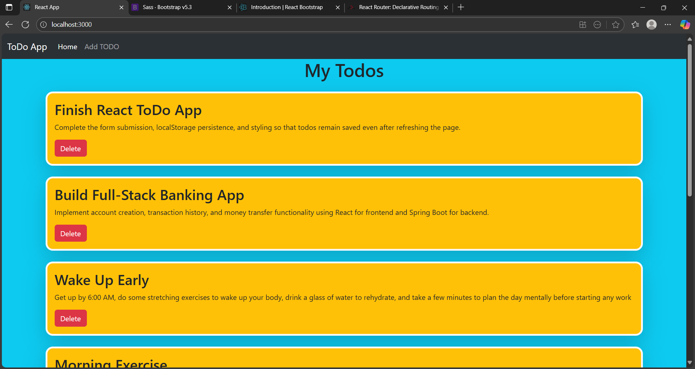
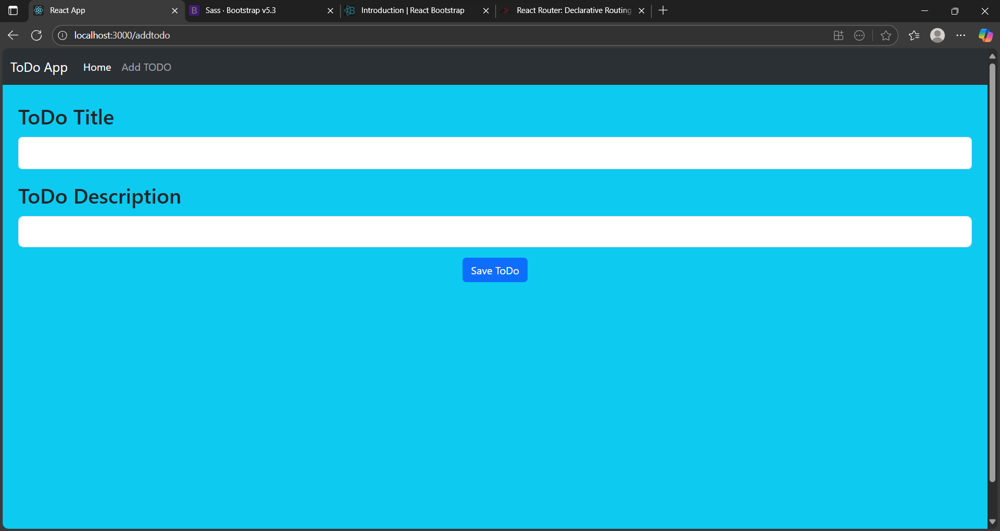

# Todo App

A web-based Todo application built with **React** that helps users manage their daily tasks efficiently. Users can **add, edit, and delete tasks**, and all data is **persisted in local storage** to survive page refreshes. The app features **inline editing**, form validation, and a responsive UI using **Bootstrap**.

---

## Features

- Add new todos with a title and description.
- Edit existing todos inline on the same page.
- Delete unwanted todos.
- Prevent blank todos with form validation.
- Todos are saved in **localStorage** for persistence.
- Responsive and clean UI using **Bootstrap**.

---

## Technologies Used

- React (Functional Components & Hooks)
- Bootstrap 5
- LocalStorage for data persistence

---

## Installation

1. **Clone the repository**

```bash
git clone https://github.com/your-username/todo-app.git
```

2. **Navigate to the project folder**

```
cd todo-app
```
3. **Install dependencies**
```
npm install
```
4. **Start the development server**
```
npm start
```
-The app will run at http://localhost:3000

---

## Usage

- Go to the Add Todo page or section.
- Fill in the Title and Description fields.
- Click Save ToDo to add a task.
- On the Home page:
        Click Delete to remove a todo.

---

## Screenshots

### Home Page


### Add Todo Page
